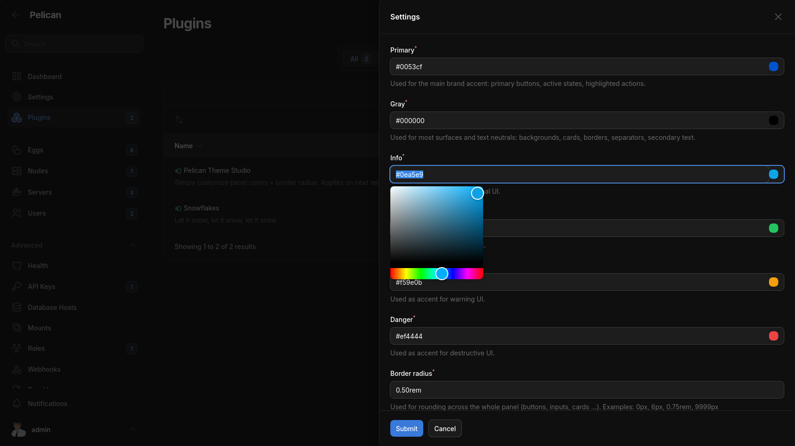
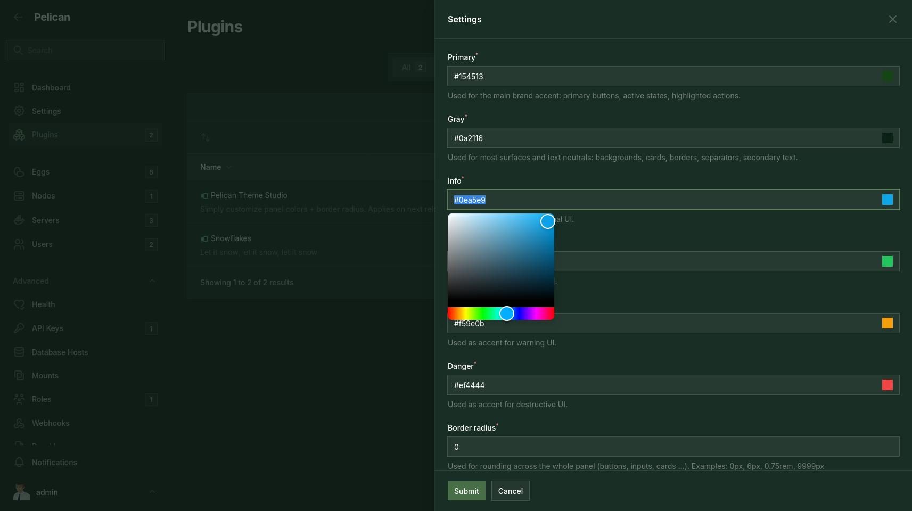
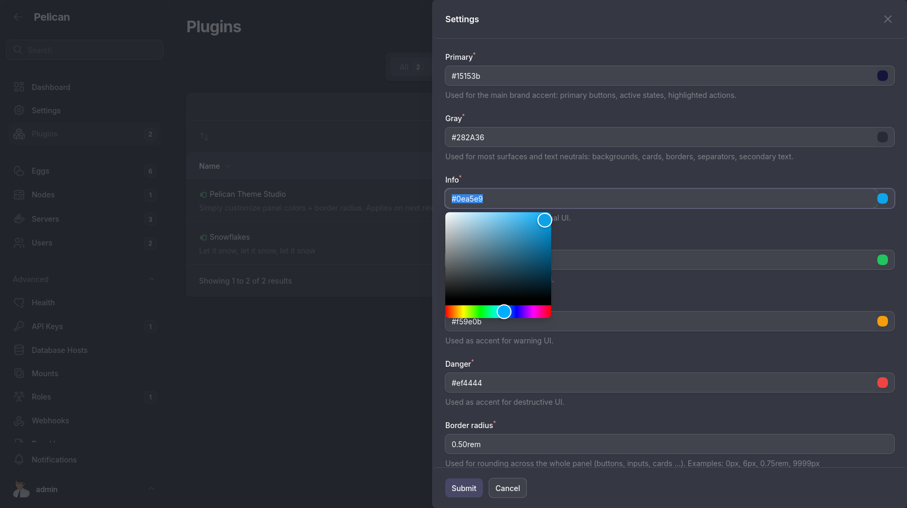
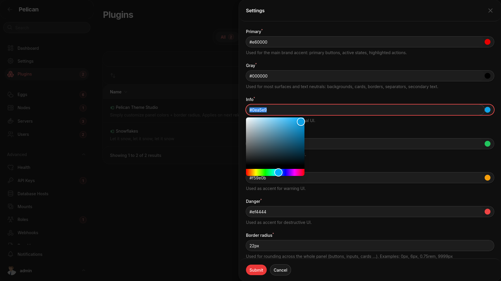

# pelican-theme-studio

A Pelican Panel theme plugin for customizing the panel’s overall look with very simple settings. It provides global color controls for **primary, gray, info, success, warning, danger**, plus a global **radius** setting to adjust rounding across most UI elements.

Settings consist of six simple colorpickers for colors & one input field for radius.

## Examples

